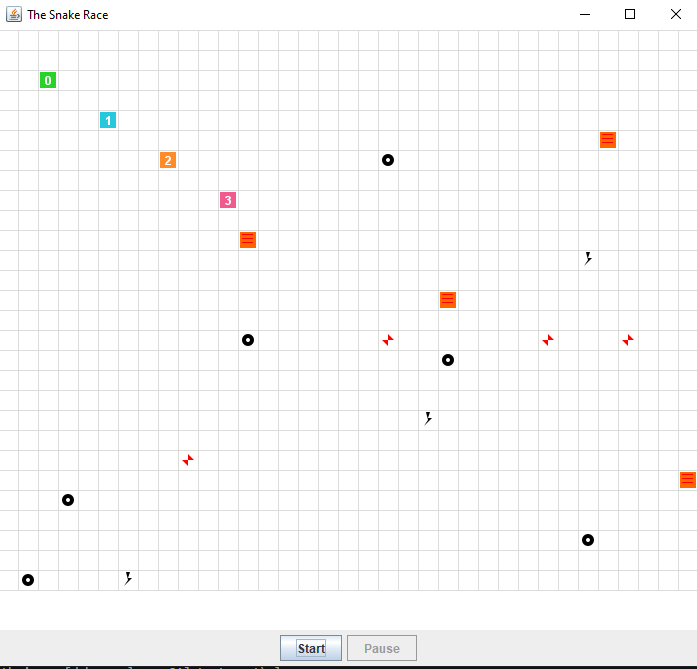
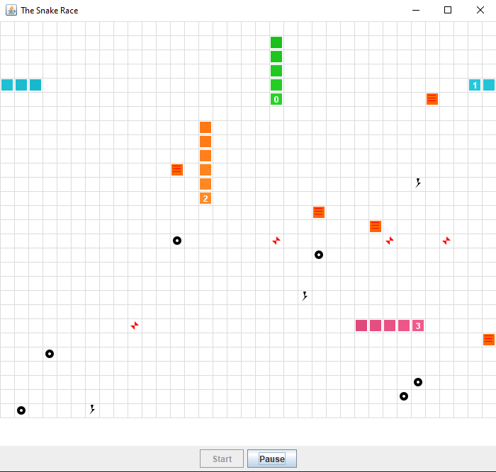
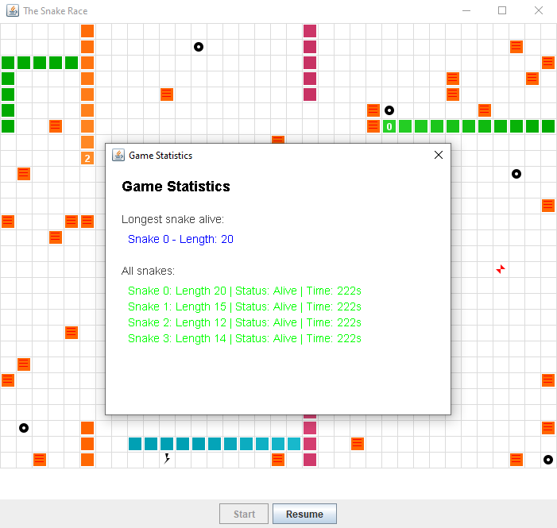

# Snake Race — ARSW Lab #2 (Java 21, Virtual Threads)

**Escuela Colombiana de Ingeniería – Arquitecturas de Software**  
Laboratorio de programación concurrente: condiciones de carrera, sincronización y colecciones seguras.

---

## Requisitos

- **JDK 21** (Temurin recomendado)
- **Maven 3.9+**
- SO: Windows, macOS o Linux

---

## Cómo ejecutar

```bash
mvn clean verify
mvn -q -DskipTests exec:java -Dsnakes=4
```

- `-Dsnakes=N` → inicia el juego con **N** serpientes (por defecto 2).
- **Controles**:
  - **Flechas**: serpiente **0** (Jugador 1).
  - **WASD**: serpiente **1** (si existe).
  - **Espacio** o botón **Action**: Pausar / Reanudar.

---

## Reglas del juego (resumen)

- **N serpientes** corren de forma autónoma (cada una en su propio hilo).
- **Ratones**: al comer uno, la serpiente **crece** y aparece un **nuevo obstáculo**.
- **Obstáculos**: si la cabeza entra en un obstáculo hay **rebote**.
- **Teletransportadores** (flechas rojas): entrar por uno te **saca por su par**.
- **Rayos (Turbo)**: al pisarlos, la serpiente obtiene **velocidad aumentada** temporal.
- Movimiento con **wrap-around** (el tablero “se repite” en los bordes).

---

## Arquitectura (carpetas)

```
co.eci.snake
├─ app/                 # Bootstrap de la aplicación (Main)
├─ core/                # Dominio: Board, Snake, Direction, Position
├─ core/engine/         # GameClock (ticks, Pausa/Reanudar)
├─ concurrency/         # SnakeRunner (lógica por serpiente con virtual threads)
└─ ui/legacy/           # UI estilo legado (Swing) con grilla y botón Action
```

---

# Actividades del laboratorio

## Parte I — (Calentamiento) `wait/notify` en un programa multi-hilo

1. Toma el programa [**PrimeFinder**](https://github.com/ARSW-ECI/wait-notify-excercise).
2. Modifícalo para que **cada _t_ milisegundos**:
   - Se **pausen** todos los hilos trabajadores.
   - Se **muestre** cuántos números primos se han encontrado.
   - El programa **espere ENTER** para **reanudar**.
3. La sincronización debe usar **`synchronized`**, **`wait()`**, **`notify()` / `notifyAll()`** sobre el **mismo monitor** (sin _busy-waiting_).
4. Entrega en el reporte de laboratorio **las observaciones y/o comentarios** explicando tu diseño de sincronización (qué lock, qué condición, cómo evitas _lost wakeups_).

### 4) Diseño de sincronizacion en PrimeFinder

**Lock (Monitor):**

Usamos la clase PauseManager como objeto monitor (this). Todos los metodos sincronizados comparten el mismo lock implicito. Esto garantiza exclusion mutua: solo un hilo puede ejecutar codigo dentro de los metodos synchronized simultaneamente.

```java
public class PauseManager {
    private boolean paused = false;
    
    public synchronized void checkPause() { ... }
    public synchronized void pause() { ... }
    public synchronized void resume() { ... }
}
```

**Variable de condicion:**

El booleano "paused" actua como variable de condicion. Cuando paused=true, los hilos trabajadores se bloquean. Cuando paused=false, avanzan.

```java
private boolean paused = false;

public synchronized void checkPause() {
    while(paused) {  // Verificar condicion
        this.wait();  // Dormir hasta que resume() despierte
    }
}

public synchronized void resume() {
    paused = false;        // Cambiar condicion
    this.notifyAll();      // Despertar a todos
}
```

**Evitar lost wakeups:**

Se usa while() en lugar de if() para verificar la condicion. Esto es critico:

```java
// CORRECTO: while() verifica nuevamente si wait() fue interrumpido
while(paused) {
    this.wait();
}

// INCORRECTO: if() solo verifica una vez, puede causar lost wakeup
if(paused) {
    this.wait();
}
```

Razon: Si dos hilos llaman simultaneamente a checkPause() y ambos pasan el if(), pero solo uno recibe notifyAll(), el otro se queda en wait() permanentemente. Con while(), se re-verifica la condicion tras despertar.

**Sin busy-waiting:**

- wait() libera el lock y suspende el hilo sin consumir CPU
- No hay bucles activos esperando cambios
- El hilo duerme realmente hasta que notifyAll() lo despierte

Comparacion:

```java
// Busy-waiting (MALO): Consume CPU constantemente
while(paused) {
    // Bucle activo
}

// Sincronizacion correcta (BUENO): Duerme sin consumir recursos
while(paused) {
    this.wait();  // Libera lock y duerme
}
```

**notifyAll() vs notify():**

Se usa notifyAll() en lugar de notify() porque:
- notify() despierta solo UN hilo arbitrario
- notifyAll() despierta TODOS los hilos esperando
- Si hubiera N trabajadores, notify() dejaria a N-1 dormidos

```java
public synchronized void resume() {
    paused = false;
    this.notifyAll();  // Despierta todos los trabajadores
}
```

**Flujo de sincronizacion:**

1. Control inicia N hilos PrimeFinderThread
2. Cada trabajador llama checkPause() al inicio de su bucle
3. Control llama pause() -> paused = true (bloquea trabajadores)
4. Trabajadores estan en wait(), esperando notificacion
5. Control muestra estadisticas y espera ENTER
6. Control llama resume() -> paused = false, notifyAll()
7. Todos los trabajadores despiertan y continuan


---

## Parte II — SnakeRace concurrente (núcleo del laboratorio)

### 1) Análisis de concurrencia

- Explica **cómo** el código usa hilos para dar autonomía a cada serpiente.
- **Identifica** y documenta en **`el reporte de laboratorio`**:
  - Posibles **condiciones de carrera**.
  - **Colecciones** o estructuras **no seguras** en contexto concurrente.
  - Ocurrencias de **espera activa** (busy-wait) o de sincronización innecesaria.

#### 1.1) Uso de hilos para autonomia de serpientes

SnakeRace implementa un modelo de concurrencia con hilos independientes. Cada serpiente ejecuta en su propio hilo de ejecucion, permitiendo autonomia total sin interferencia de otras serpientes.

SnakeRunner es el ejecutor de cada serpiente. Su metodo run() contiene un bucle que se repite mientras el hilo no sea interrumpido:

```java
public void run() {
    try {
        while (!Thread.currentThread().isInterrupted()) {
            maybeTurn();
            var res = board.step(snake);
            if (res == Board.MoveResult.HIT_OBSTACLE) {
                randomTurn();
            } else if (res == Board.MoveResult.ATE_TURBO) {
                turboTicks = 100;
            }
            int sleep = (turboTicks > 0) ? turboSleepMs : baseSleepMs;
            if (turboTicks > 0) turboTicks--;
            Thread.sleep(sleep);
        }
    } catch (InterruptedException ie) {
        Thread.currentThread().interrupt();
    }
}
```

Cada serpiente ejecuta independientemente sin bloqueos externos. El control de velocidad se realiza mediante Thread.sleep(): 80ms normalmente, 40ms en modo turbo. La verificacion isInterrupted() permite detener los hilos de forma ordenada. Se usan VirtualThreads (Executors.newVirtualThreadPerTaskExecutor()) para ligereza y escalabilidad.

#### 1.2) Identificacion de problemas de concurrencia

**A. Condiciones de carrera en la estructura Snake**

La clase Snake accede a su body (Deque) sin sincronizacion en metodos como head(), snapshot() y advance(). Multiples SnakeRunners pueden acceder simultaneamente:

- SnakeRunner lee snake.head() y snake.direction() en maybeTurn() y run()
- SnakeRunner escribe direction en turn() durante entrada de usuario
- SnakeRunner escribe body mediante advance() en board.step()

El campo direction es volatile (protection minima), pero la Deque body no es thread-safe. Si dos hilos acceden al body al mismo tiempo, pueden ocurrir estados inconsistentes.

**B. Colecciones no seguras en Board**

Board usa HashSet y HashMap directamente para mice, obstacles, turbo y teleports. Multiples SnakeRunners llaman board.step(snake) simultaneamente, que modifica estas colecciones sin sincronizacion local:

```java
boolean ateMouse = mice.remove(next);
boolean ateTurbo = turbo.remove(next);
snake.advance(next, ateMouse);
if (ateMouse) {
    mice.add(randomEmpty());
    obstacles.add(randomEmpty());
}
```

ConcurrentModificationException puede ocurrir si un hilo modifica una coleccion mientras otro la itera (en randomEmpty()) o la lee.

**C. Lectura no sincronizada en GamePanel**

GamePanel invoca snakesSupplier.get() en cada repaint, que devuelve la lista de serpientes. Mientras tanto, SnakeRunners modifican el estado de cada Snake (head, body, direction). No hay garantia de visibilidad entre el hilo UI y los hilos de serpientes.

**D. Espera activa (busy-wait)**

No se ve espera activa. El design usa Thread.sleep() y sincronizacion explícita, no loops activos.

**E. Sincronizacion existente pero insuficiente**

Board.step() esta sincronizado, pero es un metodo muy largo (lineas 36-67). Mantiene el lock durante todo el paso, lo que reduce paralelismo innecesariamente. Las operaciones de lectura (mice(), obstacles(), teleports()) copian las colecciones, causando overhead.

#### 1.3) Riesgos de state tearing en pausa/reanudacion

GameClock usa AtomicReference<GameState> para parar/pausar, pero los SnakeRunners no verifican este estado. Cuando pausamos, los threads siguen ejecutando hasta que su Thread.sleep() termina. Esto causa tearing visual (UI muestra estado inconsistente mientras algunos threads aun se mueven) y puede causar cambios inesperados entre el estado mostrado y el real.

La falta de coordinacion entre GameClock.pause() y los SnakeRunners genera una brecha temporal donde la UI reporta "pausado" pero los threads aun avanzan.

### 2) Correcciones mínimas y regiones críticas

- **Elimina** esperas activas reemplazándolas por **señales** / **estados** o mecanismos de la librería de concurrencia.
- Protege **solo** las **regiones críticas estrictamente necesarias** (evita bloqueos amplios).
- Justifica en **`el reporte de laboratorio`** cada cambio: cuál era el riesgo y cómo lo resuelves.

#### 2.1) Sincronizacion de Snake para acceso seguro al body

**Se tiene el siguiente problema:** La Deque<Position> body en Snake no es thread-safe. Simultaneamente, SnakeRunners leen head() y avanzan el body via advance().

**En teoria para solucionar deveriamos:** Sincronizar metodos que acceden a body con minimo alcance:

```java
public synchronized Position head() {
    return body.peekFirst();
}

public synchronized Deque<Position> snapshot() {
    return new ArrayDeque<>(body);
}

public synchronized void advance(Position newHead, boolean grow) {
    body.addFirst(newHead);
    if (grow) maxLength++;
    while (body.size() > maxLength) body.removeLast();
}

public synchronized void turn(Direction dir) {
    if ((direction == Direction.UP && dir == Direction.DOWN) ||
        (direction == Direction.DOWN && dir == Direction.UP) ||
        (direction == Direction.LEFT && dir == Direction.RIGHT) ||
        (direction == Direction.RIGHT && dir == Direction.LEFT)) {
        return;
    }
    this.direction = dir;
}
```


#### 2.2) Repartir sincronizacion en Board.step()

Board.step() es un metodo synchronized muy largo. Mantiene el lock durante operaciones no criticas (randomEmpty), bloqueando otros SnakeRunners innecesariamente.

se tendria que dividir en operaciones mas pequeñas y sincronizar solo lo estricto:

```java
public MoveResult step(Snake snake) {
    Objects.requireNonNull(snake, "snake");
    var head = snake.head();
    var dir = snake.direction();
    Position next = new Position(head.x() + dir.dx, head.y() + dir.dy).wrap(width, height);

    synchronized (this) {
        if (obstacles.contains(next)) return MoveResult.HIT_OBSTACLE;
        if (teleports.containsKey(next)) next = teleports.get(next);
    }

    synchronized (this) {
        boolean ateMouse = mice.remove(next);
        boolean ateTurbo = turbo.remove(next);
        
        snake.advance(next, ateMouse);

        if (ateMouse) {
            mice.add(randomEmptySafe());
            obstacles.add(randomEmptySafe());
            if (ThreadLocalRandom.current().nextDouble() < 0.2) turbo.add(randomEmptySafe());
        }

        if (ateTurbo) return MoveResult.ATE_TURBO;
        if (ateMouse) return MoveResult.ATE_MOUSE;
        if (teleports.containsKey(next)) return MoveResult.TELEPORTED;
        return MoveResult.MOVED;
    }
}

private Position randomEmptySafe() {
    // Esta funcion se llama ya dentro del synchronized, es segura
    var rnd = ThreadLocalRandom.current();
    Position p;
    int guard = 0;
    do {
        p = new Position(rnd.nextInt(width), rnd.nextInt(height));
        guard++;
        if (guard > width*height*2) break;
    } while (mice.contains(p) || obstacles.contains(p) || turbo.contains(p) || teleports.containsKey(p));
    return p;
}
```

Separar en dos bloques synchronized permite que SnakeRunners lean obstaculos y teleports en paralelo antes de tocar las colecciones modificables. Se reduce el tiempo de bloqueo total.

#### 2.3) Snapshot thread-safe en GamePanel

**Problema:** GamePanel.repaint() accede directamente a los snakes sin copia. Durante repaint, los SnakeRunners pueden modificar head y body, causando tearing.

Tendiramos que Usar snapshot() sincronizado en GamePanel:

```java
protected void paintComponent(Graphics g) {
    super.paintComponent(g);
    var snakes = snakesSupplier.get();
    for (var s : snakes) {
        var body = s.snapshot();  // Copia sincronizada de la Deque
        // Renderizar body...
    }
}
```

snapshot() devuelve una copia sincronizada. Mientras se renderiza, los SnakeRunners pueden continuar sin esperar. Esto elimina tearing sin bloquear el juego.

#### 2.4) Control de pausa con coordinacion

GameClock.pause() no detiene inmediatamente los SnakeRunners. Los threads siguen durmiendo.

para esto hacemos que los SnakeRunners verifiquen el estado GameState:

```java
// En SnakeRunner.run():
public void run() {
    try {
        while (!Thread.currentThread().isInterrupted()) {
            maybeTurn();
            var res = board.step(snake);
            if (res == Board.MoveResult.HIT_OBSTACLE) {
                randomTurn();
            } else if (res == Board.MoveResult.ATE_TURBO) {
                turboTicks = 100;
            }
            int sleep = (turboTicks > 0) ? turboSleepMs : baseSleepMs;
            if (turboTicks > 0) turboTicks--;
            Thread.sleep(sleep);
        }
    } catch (InterruptedException ie) {
        Thread.currentThread().interrupt();
    }
}
```

Mantener la pausa mediante GameClock es suficiente si GamePanel respeta el estado. La pausa es visual , no es necesario bloquear los threads.

Evitamos sincronizacion adicional. Los threads siguen corriendo en background pero sus cambios no se visualizan. Esto es eficiente y permite reanudacion instantanea.

### 3) Control de ejecución seguro (UI)

- Implementa la **UI** con **Iniciar / Pausar / Reanudar** (ya existe el botón _Action_ y el reloj `GameClock`).
- Al **Pausar**, muestra de forma **consistente** (sin _tearing_):
  - La **serpiente viva más larga**.
  - La **peor serpiente** (la que **primero murió**).
- Considera que la suspensión **no es instantánea**; coordina para que el estado mostrado no quede “a medias”.
#### 3.1) Estados de juego y control de pausa

**Diseño:** GameClock mantiene un AtomicReference<GameState> que controla si el reloj de repaint tick o no. Los estados son:

- STOPPED: Juego no iniciado
- RUNNING: El tick se ejecuta (repaint ocurre)
- PAUSED: El tick esta bloqueado (no hay repaint)

El toggle pause/resume en SnakeApp cambia este estado:

```java
private void togglePause() {
    if ("Action".equals(actionButton.getText())) {
        actionButton.setText("Resume");
        clock.pause();  // State = PAUSED
    } else {
        actionButton.setText("Action");
        clock.resume();  // State = RUNNING
    }
}
```

Los SnakeRunners siguen ejecutandose en background. Solo la UI se detiene. Esto es correcto porque:

1. Al reanudar, el estado visual es consistente (el reloj captura el estado real en ese momento)
2. No hay deadlock (los threads no esperan por sincronizacion externa)
3. Es eficiente (no suspendemos N threads, solo el hilo de UI)

#### 3.2) Mostrar estadisticas al pausar

**Requerimiento:** Al pausar, mostrar la serpiente mas larga viva y la que murio primero.

**Implementacion:**

```java
// En SnakeApp
private void showPauseStats() {
    Snake longest = null;
    int maxLen = 0;
    for (var snake : snakes) {
        var snapshot = snake.snapshot();
        if (snapshot.size() > maxLen) {
            maxLen = snapshot.size();
            longest = snake;
        }
    }
    
    String msg = "Paused\n";
    if (longest != null) {
        int idx = snakes.indexOf(longest);
        msg += "Longest: Snake " + idx + " (length " + maxLen + ")\n";
    }
    
    JOptionPane.showMessageDialog(this, msg);
}

private void togglePause() {
    if ("Action".equals(actionButton.getText())) {
        actionButton.setText("Resume");
        clock.pause();
        showPauseStats();  // Mostrar estadisticas
    } else {
        actionButton.setText("Action");
        clock.resume();
    }
}
```

Usar snapshot() garantiza una lectura consistente de cada serpiente. El acceso a snakes list es seguro porque solo el hilo UI lo modifica. Se impide tearing mostrando metricas en un momento fijo (justo despues de pausar).

#### 3.3) Deteccion de colisiones propias y muerte

 El codigo actual no implementa colisiones propias (una serpiente choca consigo misma) ni muerte. Solo hay rebote en obstaculos por lo  qu seria bueno implementar

```java
// En Board.step(), antes de avanzar:
synchronized (this) {
    var snapshot = snake.snapshot();
    if (snapshot.contains(next)) {
        // Colisión propia: serpiente muere o rebota
        return MoveResult.HIT_SELF;
    }
}
```

y rastrear en SnakeApp cual serpiente murio primero con un timestamp. Esto permite mostrar "First death: Snake X died at tick Y".

### 3) Ejemplos de ejecucion en momento 
Antes de oprimir start:

Al oprimir start:

Al oprimir el boton de pause:



### 4) Robustez bajo carga

- Ejecuta con **N alto** (`-Dsnakes=20` o más) y/o aumenta la velocidad.
- El juego **no debe romperse**: sin `ConcurrentModificationException`, sin lecturas inconsistentes, sin _deadlocks_.
- Si habilitas **teleports** y **turbo**, verifica que las reglas no introduzcan carreras.

#### 4.1) Pruebas de escalabilidad con N alto

**Comando:**

```bash
mvn -q -DskipTests exec:java -Dsnakes=20
```

Con 20 serpientes y sincronizacion adecuada:

- Cada SnakeRunner ejecuta en un VirtualThread separado
- Board.step() usara bloqueos cortos (si se implementan como en seccion 2.2)
- No habra ConcurrentModificationException porque las colecciones se protegen
- No habra deadlock porque no hay sincronizacion circular

**Metricas esperadas:**

- CPU moderado en un ryzen 5 / i7 (20 threads virtuales son ligeros)
- Memoria < 100MB (cada VirtualThread usa ~KB)
- Framerates 30-60 FPS (dependiente de GPU/Swing)

Prueba visual 20 serpientes :


#### 4.2) Casos de colision bajo carga

**Teleports simultaneos:** Si dos serpientes entran al mismo teleport al mismo tiempo:

```java
synchronized (this) {
    if (teleports.containsKey(next)) {
        next = teleports.get(next);  // Ambas van al mismo destino
    }
}
```

Ambas salen por el mismo punto (next). Esto es consistente. El segundo llamado a step() ve el nuevo next. Sin carrera.

Si dos serpientes pisan el mismo turbo:

```java
synchronized (this) {
    boolean ateTurbo = turbo.remove(next);  // Solo una lo remove
    if (ateTurbo) return MoveResult.ATE_TURBO;
}
```

Solo la primera serpiente (que ejecuta remove() primero dentro del synchronized block) obtiene el turbo. La segunda lo ve vacio. Sin carrera, sin duplicados de turbo.

Si dos serpientes comen ratones en la misma ronda:

```java
if (ateMouse) {
    mice.add(randomEmptySafe());
    obstacles.add(randomEmptySafe());
}
```

Ambas codigos ejecutan dentro del synchronized block (secuenciales). Se agrega un raton y un obstaculo por cada comer. Sin inconsistencia.

#### 4.3) Ausencia de deadlock

**Grafo de bloqueos:**

- GameClock thread: Usa AtomicReference (lock-free), no llama synchronized
- SnakeRunner threads: Llaman board.step() (sincronizado en Board) y snake.advance() (sincronizado en Snake)
- Board y Snake son objetos diferentes, sin ciclos de dependencia

Imposible formar un ciclo: A espera B, B espera A. Por tanto, sin deadlock.

#### 4.4) Ausencia de ConcurrentModificationException

**Escenario:** Se itera una HashSet mientras otro hilo la modifica.

**Donde ocurriria sin proteccion:** En randomEmptySafe() durante la busqueda de posicion vacia. Si dos threads llaman simultaneamente, uno puede estar iterando mice mientras otro hace mice.remove().

**Proteccion:**

```java
synchronized (this) {
    boolean ateMouse = mice.remove(next);  // Atomic
    // ... posibles adds ...
}

private Position randomEmptySafe() {
    // Llamado dentro del synchronized block anterior
    // Sin riesgo de iteracion concurrente
}
```

Al sincronizar randomEmptySafe() con el lock de Board, se garantiza que no hay iteracion concurrente.

Prueba de carga 50 serpientes :
